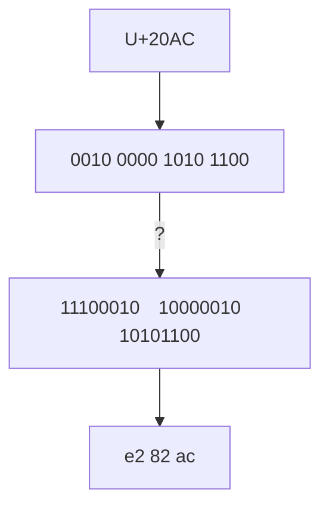

## 字符

&emsp;&emsp;一般而言，可以使用 Unicode 字符集来定义字符。
&emsp;&emsp;字符的标识和其具体的字节表述有明确区分：

- 字符标识，即字符码位，在 Unicode 标准中以 4-6 个十六进制数字表示，且加前缀“U+”。例如 A 的码位是 U+0041，欧元符号 € 码位是 U+20AC
- 字符的字节表述取决于所用的编码，编码是在码位和字节序列之间转换时使用的算法。在 UTF-8 中，A 的码位编码为\x41，欧元符号编码为\xe2\x82\xac

## 字符的字节表述

&emsp;&emsp;本文只介绍一般情况下的默认情况，即 Unicode 字符，UTF-8 编码情况。并使用例子介绍如何将码位转换为编码。

> 以欧元符号 € 为例：
> 码位：U+20AC
> 二进制编码：0010 0000 1010 1100
> utf-8 编码：e2 82 ac

&emsp;&emsp;这一过程如何完成呢？
&emsp;&emsp;首先将 16 进制的 20AC 转换为二进制，即为 0010 0000 1010 1100，然后需要将该二进制编码修改为二进制的 utf-8 编码。
&emsp;&emsp;**注意 utf-8 编码规定了占位规则：**

1. 可以用单字节表示的二进制码最高位设置 0，即单字节有效 7 位
2. 用双字节表示的首字节前三位设为 110，第二个字节前两位设为 10，即双字节有效 13 位
3. 用三字节表示的三个字节首位分别设置为 1110、10、10，即三字节有效 16 位
4. 四字节表示各字节首位分别设置为 11110、10、10、10，即四字节有效 21 位

&emsp;&emsp;**数一数欧元符号的二进制编码，需要 14 位**，因此需要使用三个字节来表示，按照规则填充，则其 utf-8 的二进制编码为11100010&emsp;10000010&emsp;10101100，将之转换为 16 进制，即为 e2&emsp;82&emsp;ac，因此编码为编码为\xe2\x82\xac
